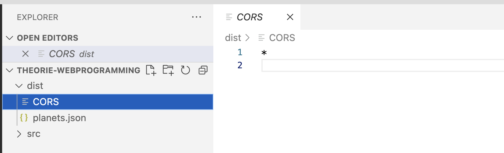

# Deployment met Surge

## Introductie

In dit hoofdstuk maken we gebruik van Surge.sh om onze webpage te hosten.

<figure><figcaption><p>Screenshot from surge.sh</p></figcaption></figure>

[Surge.sh](https://www.surge.sh) is een cloud-gebaseerde dienst die eenvoudig en snel statische websites kan hosten. Het is populair onder ontwikkelaars omdat het een zeer eenvoudige interface biedt voor het deployen van statische sites, zoals HTML, CSS, en JavaScript projecten, naar het web.

## Installatie

installeer éénmalig Surge door middel van het volgende commando

```
npm i -g surge
```

of mac gebruikers:

```
sudo npm i -g surge
```

## Gebruik

Geef in de terminal het volgende commando in:&#x20;

```bash
surge
```

Surge zal dan vragen welke folder je wil publiceren. Hier geef je dus je 'dist' folder in. Surge zal dan een random domeinnaam voorstellen. Je kan deze wijzigen zolang deze maar eindigt op surge.sh.

### Kan dit sneller?

ja, dit alles kan tevens in 1 commando:&#x20;

```bash
surge /dist mijngewenstdomein.surge.sh
```

## CORS

CORS staat voor Cross-Origin Resource Sharing.

Deze techniek zorgt ervoor dat je alleen dingen van een andere server kunt halen als die server dat toestaat. Dit is een **beveiligingsmaatregel** om te voorkomen dat iemand stiekem gegevens steelt of misbruik maakt van een website.

Als je bestanden (bijvoorbeeld json) wilt hosten in surge, moet je een CORS bestand voorzien om toelating te geven aan andere websites om jouw bestanden aan te kunnen spreken.

Voeg een nieuw bestand CORS toe in de dist folder en vul in dit bestand de domeinen toe die jouw gegevens mogen aanspreken.

Mag iedereen er aan, zet dan \* in je CORS bestand.

Na het aanmaken van dit bestand moet je uiteraard opnieuw **surge** uitvoeren om dit CORS bestand op je hosting te zetten.

<figure><figcaption></figcaption></figure>
