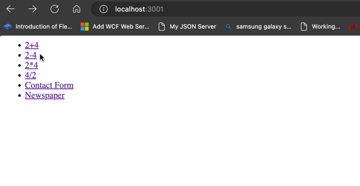

# Router Combi

We gaan een combinatie oefening maken van drie voorgaande oefeningen: [Math Service](../labo7/labo9/math-service-express.md), [News Paper Search](../labo7/labo9/newspaper-search.md) en [Contact Form](../labo7/labo10/contact-form.md).

Je mag zelf kiezen van welk project je als begin wilt gebruiken, je mag ook helemaal opnieuw beginnen en een nieuw project maken.

Maak 3 verschillende routers aan, die elk een van de bovenstaande oefeningen uitvoeren. De routers moeten de volgende paden hebben:

* `/math`
* `/newspaper`
* `/contact`

Je mag zelf kiezen welke naam je de bestanden geeft, maar zorg ervoor dat je de bestanden in een aparte map zet, bijvoorbeeld `routers`.

De werking van de applicatie moet hetzelfde blijven als de oefeningen die je hebt gekozen, maar dan verdeeld over drie routers.

Zorg dat de `/` route van je applicatie een overzicht geeft van de drie verschillende routes die je hebt gemaakt.

