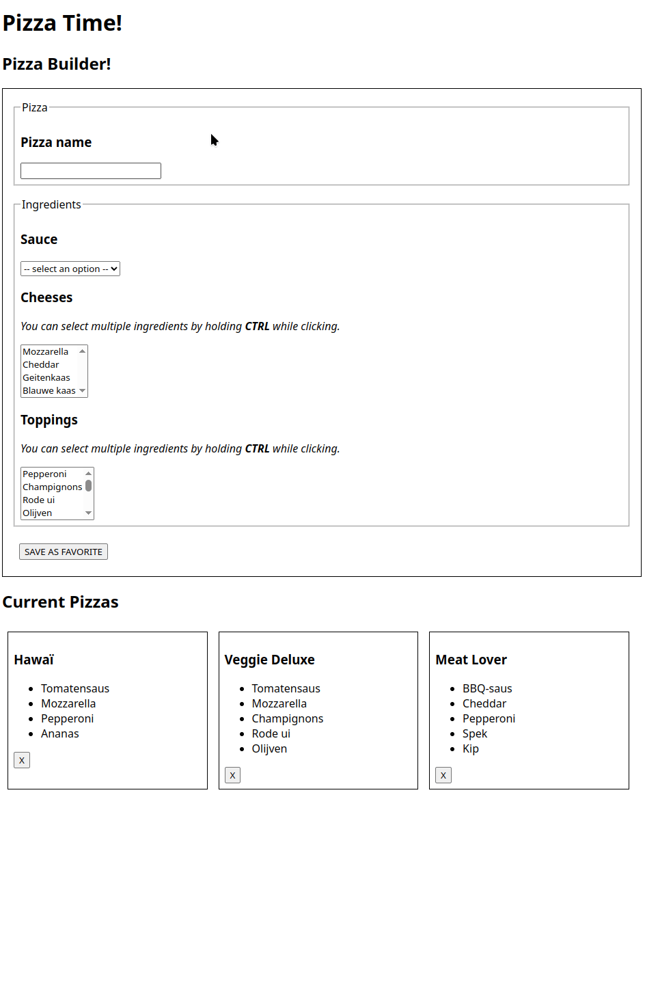

# Full-Stack: Pizza Builder

## Doel van de oefening

Je gaat een webapplicatie bouwen in twee delen:

1. **Pizza Builder**
   * Met dit formulier kan je een nieuwe pizza samenstellen.
   * De ingredienten worden ingeladen vanuit de database.
   * Je kan meerdere soorten kaas en meerdere soorten toppings selecteren.
   * Je kan slechts één soort saus selecteren.
2. **Pizza Overview**
   * Een overzicht van alle opgeslagen pizza's.
   * Elke pizza heeft een verwijder-knop. Hiermee wordt de pizza verwijdert uit het systeem.
     * _Bekijk de database-structuur aandachtig! Een pizza bestaat enerzijds uit een record uit de `pizzas` tabel, maar ook uit records uit de `pizza_ingredients` tabel!_

<figure><figcaption></figcaption></figure>

## Functionaliteiten <a href="#functionaliteiten" id="functionaliteiten"></a>

### 1. Front-end (Vite + TypeScript) <a href="#id-1.-front-end-vite--typescript" id="id-1.-front-end-vite--typescript"></a>

* Haal de ingredienten op via uit je database
* Splits de lijst op volgens type:
  * sauzen
  * kazen
  * toppings
* Toon elk ingredient in het juiste `<select>` element.
  * Gebruik het `multiple` attribute om een multi-select te maken.

### 2. Back-end (Express + MySQL) <a href="#id-2.-back-end-express--mysql" id="id-2.-back-end-express--mysql"></a>

Je maakt endpoints aan om de vangstatus en party bij te houden:

**Endpoints**

* `GET /pizzas`: Geeft een lijst terug van alle pizza's
* `POST /pizzas`: Maak een nieuwe pizza aan, en link de pizza aan de juiste ingredienten in de `pizza_ingredients` tabel
* `DELETE /pizzas`: Verwijdert een pizza, en verwijdert ook alle records van die pizza uit de `pizza_ingredients` tabel
* `GET /ingredients`: Geeft een lijst terug van alle ingredienten

## Stappenplan <a href="#stappenplan" id="stappenplan"></a>

### 1. Voorbereiding <a href="#id-1.-voorbereiding" id="id-1.-voorbereiding"></a>

* Zet je Frontend-project op met Vite
* Zet je backend project op met Express
* Configureer een lokale MySQL-database

<details>

<summary>Database SQL init</summary>

```sql
CREATE TABLE ingredients (
  id INT AUTO_INCREMENT PRIMARY KEY,
  name VARCHAR(100) NOT NULL,
  type ENUM('sauce', 'cheese', 'topping') NOT NULL
);

CREATE TABLE pizzas (
  id INT AUTO_INCREMENT PRIMARY KEY,
  name VARCHAR(100) NOT NULL
);

CREATE TABLE pizza_ingredients (
  pizza_id INT,
  ingredient_id INT,
  PRIMARY KEY (pizza_id, ingredient_id),
  FOREIGN KEY (pizza_id) REFERENCES pizzas(id) ON DELETE CASCADE,
  FOREIGN KEY (ingredient_id) REFERENCES ingredients(id)
);

CREATE TABLE order_pizzas (
  id INT AUTO_INCREMENT PRIMARY KEY,
  pizza_id INT,
  FOREIGN KEY (pizza_id) REFERENCES pizzas(id)
);

INSERT INTO ingredients (id, name, type) VALUES
-- Sauzen
(1, 'Tomatensaus', 'sauce'),
(2, 'BBQ-saus', 'sauce'),
(3, 'Witte knoflooksaus', 'sauce'),

-- Kazen
(4, 'Mozzarella', 'cheese'),
(5, 'Cheddar', 'cheese'),
(6, 'Geitenkaas', 'cheese'),
(7, 'Blauwe kaas', 'cheese'),

-- Toppings
(8, 'Pepperoni', 'topping'),
(9, 'Champignons', 'topping'),
(10, 'Rode ui', 'topping'),
(11, 'Olijven', 'topping'),
(12, 'Ananas', 'topping'),
(13, 'Paprika', 'topping'),
(14, 'Spek', 'topping'),
(15, 'Spinazie', 'topping'),
(16, 'Artisjok', 'topping'),
(17, 'Kip', 'topping');

INSERT INTO pizzas (id, name) VALUES
(1, 'Hawaï'),
(2, 'Veggie Deluxe'),
(3, 'Meat Lover');

-- Hawaï: Tomatensaus, Mozzarella, Ananas, Ham/Pepperoni
INSERT INTO pizza_ingredients (pizza_id, ingredient_id) VALUES
(1, 1),  -- Tomatensaus
(1, 4),  -- Mozzarella
(1, 12), -- Ananas
(1, 8);  -- Pepperoni

-- Veggie Deluxe: Tomatensaus, Mozzarella, Champignons, Rode ui, Olijven
INSERT INTO pizza_ingredients (pizza_id, ingredient_id) VALUES
(2, 1),  -- Tomatensaus
(2, 4),  -- Mozzarella
(2, 9),  -- Champignons
(2, 10), -- Rode ui
(2, 11); -- Olijven

-- Meat Lover: BBQ-saus, Cheddar, Kip, Pepperoni, Spek
INSERT INTO pizza_ingredients (pizza_id, ingredient_id) VALUES
(3, 2),  -- BBQ-saus
(3, 5),  -- Cheddar
(3, 17), -- Kip
(3, 8),  -- Pepperoni
(3, 14); -- Spek
```


</details>

### 2. Front-end implementatie <a href="#id-2.-front-end-implementatie" id="id-2.-front-end-implementatie"></a>

* Maak een module `pizzabuilder.ts` om de data voor je pokédex op te vragen
* Bouw componenten voor:
  * Pokedex lijst
  * Party overzicht

### 3. Back-end implementatie <a href="#id-3.-back-end-implementatie" id="id-3.-back-end-implementatie"></a>

* Schrijf de nodige Express-routes
* Verbind je server met MySQL en implementeer de CRUD-logica
* Zorg ervoor dat alle routes JSON teruggeven
