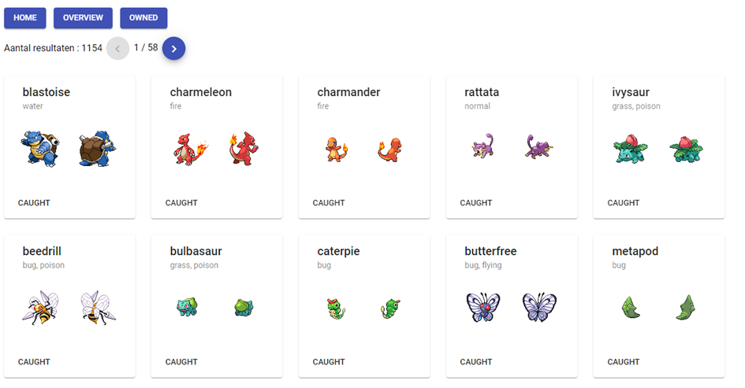

# Verander achtergrond

Maak een nieuw VITE project verander-achtergrond

Schrijf HTML en een script dat de achtergrond van een div laat veranderen na klikken op de knop 'verander'. Als je een tweede maal op de knop drukt, gaat de achtergrond terug weg.

Kies zelf of je een inline event handler of event listener gebruikt.

<figure><figcaption></figcaption></figure>

<figure><figcaption></figcaption></figure>
